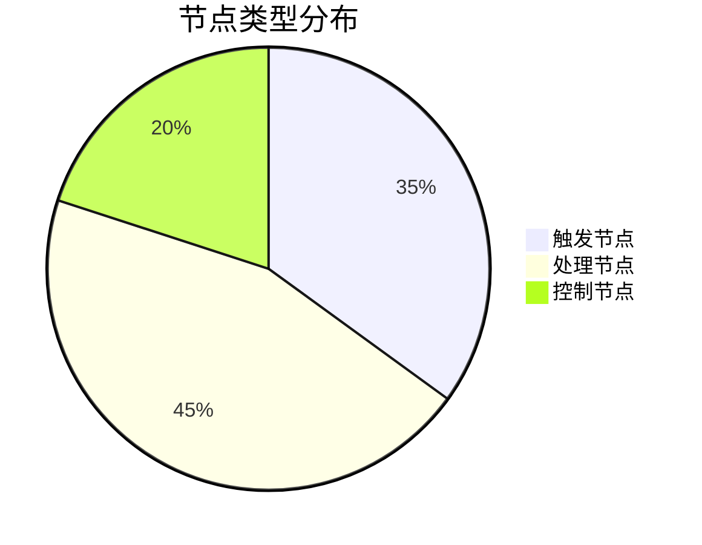
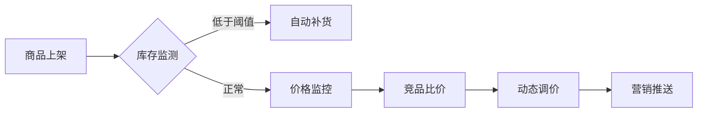

# 解锁自动化新姿势：n8n 工作流如何重塑AI生产力？

## 一、n8n 核心解析：开源生态的自动化革命

### 1.1 背景溯源

n8n 诞生于2019年柏林，作为**Fair Code**理念的践行者，其开源架构允许企业自由定制与商业化应用。不同于传统SaaS模式，n8n通过社区驱动持续迭代，GitHub上已积累91k+星标，成为AI自动化领域的现象级工具。

### 1.2 竞品对比

| 维度  | n8n | Zapier/Make | Coze |
| --- | --- | --- | --- |
| 部署方式 | 本地/云端自托管 | 全托管 | 云端托管 |
| 扩展能力 | 400+节点+自定义代码 | 有限插件 | 封闭式生态 |
| AI集成 | DeepSeek等原生支持 | 依赖第三方API | 限定大模型生态 |
| 成本  | 完全免费 | 按任务付费 | 企业级收费 |


### 1.3 核心优势

- ​**技术可控性**：支持Docker部署，数据完全自主管理
  
- ​**智能融合**：内置LangChain框架，实现自然语言转工作流
  
- ​**生态兼容**：无缝对接飞书/钉钉等国内生态，支持HTTP自定义API
  


## 二、极速部署指南：5分钟搭建自动化中枢

### 2.1 环境准备

Docker Compose 部署（推荐生产环境）

```yaml
version: '3'
services:
 n8n:
   image: n8nio/n8n
   restart: always
   ports:
     - "5678:5678"
   volumes:
     - ./n8n_data:/home/node/.n8n
   environment:
     - TZ=Asia/Shanghai
     - N8N_BASIC_AUTH_ACTIVE=true
     - N8N_BASIC_AUTH_USER=admin
     - N8N_BASIC_AUTH_PASSWORD=your_password
```

### 2.2 访问配置

1. 执行部署命令：

```bash
    docker-compose up -d
```

2. 访问 https://localhost:5678（首次使用需生成SSL证书)
  
3. 完成初始化设置向导```
  

### 2.3 高级配置

#### HTTPS设置（推荐）

```nginx
server {
    listen 443 ssl;
    server_name n8n.yourdomain.com;

    ssl_certificate /etc/letsencrypt/live/n8n/fullchain.pem;
    ssl_certificate_key /etc/letsencrypt/live/n8n/privkey.pem;

    location / {
        proxy_pass http://localhost:5678;
        proxy_set_header Host $host;
        proxy_set_header X-Real-IP $remote_addr;
    }
}
```

## 三、功能深度解构：从基础到进阶

### 3.1 节点系统详解

#### 核心节点分类与功能



| 类型  | 代表节点 | 功能说明 |
| --- | --- | --- |
| 触发器 | Cron、Webhook、Database | 事件源触发工作流 |
| 处理器 | HTTP Request、IF、Set | 数据处理与逻辑控制 |
| 集成节点 | Google Sheets、Salesforce | 第三方系统对接 |

#### 节点连接规则

````
```mermaid
graph LR
    A[触发器] --> B(处理器)
    B --> C{判断节点}
    C -->|条件满足| D[集成器]
    C -->|条件不满足| E[通知节点]
    D --> F[日志记录]
    E --> F

````

#### 节点配置示例

```yaml
HTTP Request节点配置示例
- name: fetch_weather
  type: n8n-nodes-base.httpRequest
  typeVersion: 1
  config:
    url: "{{config.apiUrl}}"
    method: GET
    options:
      headers:
        Authorization: Bearer {{config.apiKey}}
```

### 3.2 AI集成方案

#### LangChain工作流示例

```python
# 自动化文献综述生成
from langchain import n8n

def research_workflow(params):
    query = params.get('keyword', 'AI automation')
    
    # 调用n8n节点链
    results = n8n.execute_workflow([
        {
            'node': 'Google Scholar Search',
            'params': {'query': query, 'limit': 10}
        },
        {
            'node': 'Summarizer',
            'params': {'input': '{{results}}', 'model': 'deepseek-summarizer'}
        }
    ])
    
    return results
```

### 3.3 行业解决方案

#### 电商运营自动化



## 结语：自动化未来已来

n8n 正在构建人机协作的数字神经系统，其独特价值体现在：

- 开源生态带来的技术自主权
  
- 节点式编程降低自动化门槛
  
- AI原生能力加速智能决策